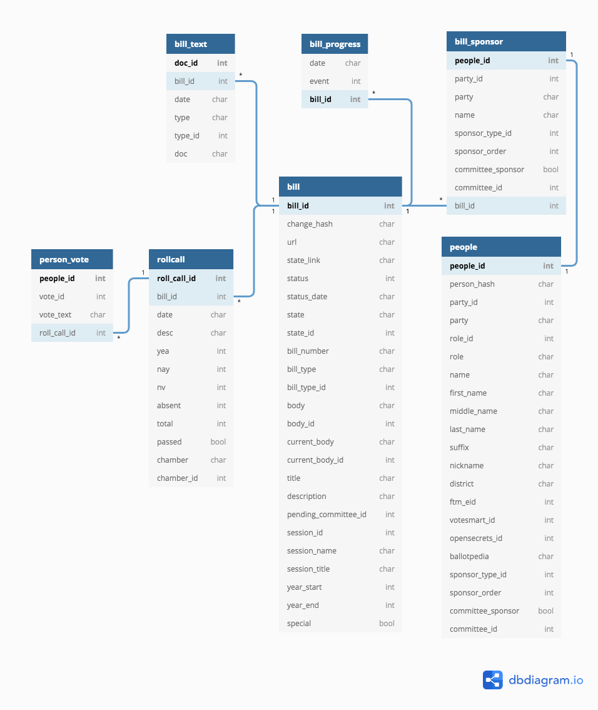

```{r setup, include = FALSE}
knitr::opts_chunk$set(
  collapse = TRUE,
  comment = "#>",
  warning = FALSE,
  message = FALSE
)
```

```{r}
library(legiscanrr)
library(dplyr)
```


## Bill metadata
 
Bill meta-data. Returned from `parse_bill()` function.

* `bill_id`: **Internal identifier** for bill used by LegiScan.
* `change_hash`: MD5 hash of bill detail information
* `url`: LegiScan URL for bill detail
* `state_link`: State legislature URL for bill detail
* `status`: Final status of the bill. Numeric id, See [lookup table vignette](../articles/lookup-table.html) for descriptions.
* `status_date`: Date of final status
* `state`: Abbreviation of the State
* `state_id`: **Internal identifier** for state. (note: 1-50 for states, 51-DC, 52-Congress)
* `bill_number`: Bill number as assigned in legislative session. **Not** unique identifier. Only unique within state-session.
* `bill_type`: Type of the bill instrument text. See [lookup table vignette](../articles/lookup-table.html) for descriptions.
* `bill_type_id`: See above above. 
* `body`: Originating body/chamber for the bill
* `body_id`: **Internal identifier** for body
* `current_body`: Current body/chamber
* `current_body_id`: **Internal identifier** for body
* `title`: Short title of bill 
* `description`: Long title and description of bill
* `pending_committee_id`: **Internal identifier** for committee
* `session_id`: **Internal identifier** for legislative session
* `session_name`: Session name
* `session_title`: Normalized session title
* `year_start`: Starting year of the session
* `year_end`: Ending year of the session
* `special`: Flag for special sessions (0, 1)

```{r}
HB1 <- system.file("extdata", "bill/HB1.json", package = "legiscanrr")

parse_bill(HB1) %>% rmarkdown::paged_table()
```


## Bill full text

Bill text information. Returned from `get_bill_text()`. See `decode_bill_text()` and [vignette](../articles/decode-bill-text.html) for how to retrieve text from the base64 encoded document.

* `doc_id`: **Internal identifier** for bill text document
* `bill_id`: **Internal identifier** for bill
* `date`: Date of text (if available)
* `type`: Type of draft text. See [lookup table vignette](../articles/lookup-table.html) for descriptions.
* `type_id`: **Internal identifier** for bill text type
* `doc`: Base64 encoded document

```{r}
get_bill_text(doc_id = 1877162)
```


## Bill progress

Returned from `parse_bill_progress()` function. Includes important event only. **Not** complete action history.


* `date`: Progress event date
* `event`: **Internal identifier** for progress event type id. See [lookup table vignette](../articles/lookup-table.html) for descriptions.
* `bill_id`: **Internal identifier** for bill

```{r}
parse_bill_progress(HB1) %>% rmarkdown::paged_table()
```


## Bill sponsors

Returned from `parse_bill_sponsor()`.

* `people_id`: **Internal identifier** for legislator
* `party_id`: **Internal identifier** for party
* `party`: Legislator party affiliation
* `name`: Legislator full name
* `sponsor_type_id`: **Internal identifier** for sponsor type. See [lookup table vignette](../articles/lookup-table.html) for descriptions.
* `sponsor_order`: Index of order in sponsorship list
* `committee_sponsor`: Flag for committee sponsor (0, 1)
* `committee_id`: **Internal identifier** for committee
* `bill_id`: **Internal identifier** for bill

```{r}
parse_bill_sponsor(HB1) %>% rmarkdown::paged_table()
```


## Legislator information

Returned from `parse_people()`.

* `people_id`: **Internal identifier** for legislator
* `person_hash`: MD5 hash for legislator personal detail information
* `state_id`: **Internal identifier** for state
* `party_id`: **Internal identifier** for party
* `party`: Legislator party affiliation
* `role_id`: **Internal identifier** for legislator role 
* `role`: Legislator role (e.g. representative, senator)
* `name`: Legislator full name
* `first_name`v
* `middle_name`
* `last_name`
* `suffix`
* `nickname`
* `district`: Legislative district
* `ftm_eid`: [FollowTheMoney.org](https://www.followthemoney.org/) EID
* `votesmart_id`: [VoteSmart.org](https://votesmart.org/) ID
* `opensecrets_id`: [OpenSecrets.org](https://www.opensecrets.org) ID (Congress Only)
* `ballotpedia`: [Ballotpedia](https://ballotpedia.org/Main_Page) name
* `committee_sponsor`: Flag for committee sponsor (0, 1)
* `committee_id`: **Internal identifier** for committee

```{r}
person_8630 <- system.file("extdata", "people/8630.json", package = "legiscanrr")
parse_people(person_8630) %>% rmarkdown::paged_table()
```


## Legislator vote records

Returned from `parse_person_vote()`.

* `people_id`: **Internal identifier** for legislator
* `vote_id`: Numeric id for vote
* `vote_text`: Description of vote (Yea/Nay/Abstain/Absent)
* `roll_call_id`: **Internal identifier** for roll call vote


```{r}
vote_154366 <- system.file("extdata", "vote/154366.json", package = "legiscanrr")
parse_person_vote(vote_154366) %>% rmarkdown::paged_table()
```


## Roll call votes

Returned from `parse_rollcall_vote()`.

* `roll_call_id`: **Internal identifier** for roll call vote
* `bill_id`: **Internal identifier** for bill
* `date`: Vote date
* `desc`: Description of vote
* `yea`: Count of Yea votes
* `nay`: Count of Nay votes
* `nv`: Count of not voting/abstain
* `absent`: Count of absents
* `total`: Total number of votes
* `passed`: Vote passage (0, 1)
* `chamber`: Chamber of vote
* `chamber_id`: **Internal identifier** for chamber


```{r}
parse_rollcall_vote(vote_154366) %>% rmarkdown::paged_table()
```

## Keys for join


